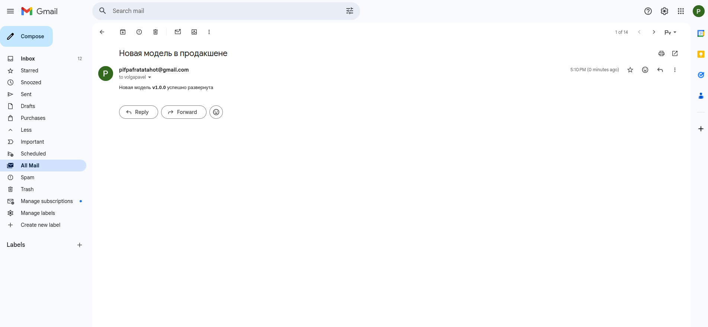
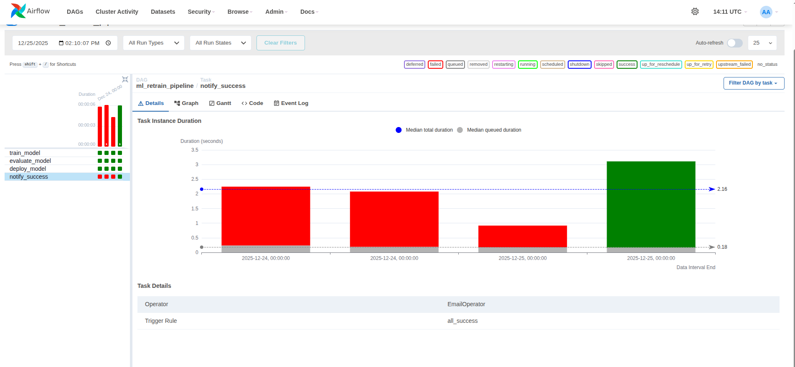
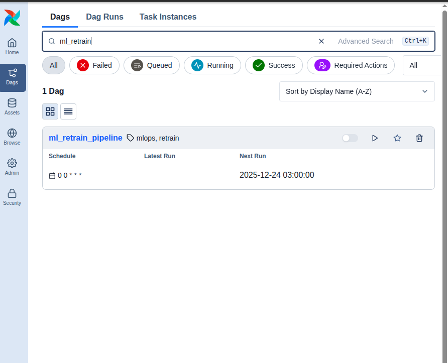

# ML Retrain Pipeline — Airflow в Docker

Проект демонстрирует автоматизацию ML-пайплайна с использованием Apache Airflow, развёрнутого в Docker. После успешного деплоя модели отправляется email-уведомление.

## 🏗️ Архитектура

```
┌─────────────────────────────────────────────────────────────────┐
│                        Docker Compose                           │
├─────────────────┬─────────────────┬─────────────────────────────┤
│   PostgreSQL    │  Airflow        │  Airflow                    │
│   (metadata)    │  Scheduler      │  Webserver                  │
│   :5432         │                 │  :8080                      │
└─────────────────┴─────────────────┴─────────────────────────────┘
                           │
                           ▼
┌─────────────────────────────────────────────────────────────────┐
│                    DAG: ml_retrain_pipeline                     │
├─────────────┬─────────────────┬──────────────┬──────────────────┤
│ train_model │ evaluate_model  │ deploy_model │ notify_success   │
│ (Python)    │ (Python)        │ (Python)     │ (EmailOperator)  │
└─────────────┴─────────────────┴──────────────┴──────────────────┘
                                                       │
                                                       ▼
                                              📧 Email (Gmail SMTP)
```

## 📁 Структура проекта

```
HW5_MLOPS/
├── dags/
│   └── ml_retrain_pipeline.py   # DAG с ML-пайплайном
├── logs/                         # Логи Airflow (создаётся автоматически)
├── plugins/                      # Плагины Airflow
├── screenshot/                   # Скриншоты для документации
│   ├── airflow_notify.png       # UI Airflow с notify_success
│   ├── mail.png                 # Полученное email-уведомление
│   └── image.png                # DAG Run Details
├── docker-compose.yaml          # Конфигурация Docker
├── .env                         # Переменные окружения (SMTP креды)
└── README.md
```

## 🚀 Быстрый старт

### 1. Клонирование и подготовка

```bash
git clone <repo>
cd HW5_MLOPS

# Создать необходимые директории
mkdir -p logs plugins
```

### 2. Настройка SMTP для email-уведомлений

Отредактируйте файл `.env`:

```env
# Airflow UID (для Linux)
AIRFLOW_UID=1000

# Логин/пароль для Airflow UI
_AIRFLOW_WWW_USER_USERNAME=admin
_AIRFLOW_WWW_USER_PASSWORD=admin

# SMTP настройки для Gmail
SMTP_HOST=smtp.gmail.com
SMTP_PORT=587
SMTP_USER=your_email@gmail.com
SMTP_PASSWORD=xxxx xxxx xxxx xxxx  # App Password!
SMTP_MAIL_FROM=your_email@gmail.com

# Версия модели (передаётся в уведомление)
MODEL_VERSION=v1.0.0
```

> ⚠️ **Важно:** Для Gmail нужен App Password, а не обычный пароль!

### 3. Получение App Password для Gmail

1. Перейдите: https://myaccount.google.com/security
2. Убедитесь, что включена **двухфакторная аутентификация**
3. Перейдите: https://myaccount.google.com/apppasswords
4. Выберите **"Other (Custom name)"** → введите **"Airflow"**
5. Нажмите **"Generate"**
6. Скопируйте 16-символьный пароль в `.env`

### 4. Запуск

```bash
docker compose up -d
```

Дождитесь инициализации (~30-60 секунд):

```bash
docker compose ps
```

Все сервисы должны быть в статусе `healthy`:

```
NAME                            STATUS
hw5_mlops-postgres-1            Up (healthy)
hw5_mlops-airflow-scheduler-1   Up (healthy)
hw5_mlops-airflow-webserver-1   Up (healthy)
```

### 5. Открытие Airflow UI

- **URL:** http://localhost:8080
- **Логин:** `admin`
- **Пароль:** `admin`

## 📊 DAG: ml_retrain_pipeline

### Задачи (Tasks)

| Task | Оператор | Описание |
|------|----------|----------|
| `train_model` | PythonOperator | Обучение модели |
| `evaluate_model` | PythonOperator | Оценка метрик модели |
| `deploy_model` | PythonOperator | Деплой модели в продакшен |
| `notify_success` | EmailOperator | Отправка email-уведомления |

### Последовательность выполнения

```
train_model → evaluate_model → deploy_model → notify_success
```

### Код DAG

```python
from airflow import DAG
from airflow.operators.python import PythonOperator
from airflow.operators.email import EmailOperator
from datetime import datetime
import os

MODEL_VERSION = os.getenv("MODEL_VERSION", "v1.0.0")

def train_model():
    print("Модель обучена")

def evaluate_model():
    print("Модель оценена, метрики в норме")

def deploy_model():
    print("Модель выведена в продакшен")

with DAG(
    dag_id="ml_retrain_pipeline",
    start_date=datetime(2025, 1, 1),
    schedule="@daily",
    catchup=False,
    tags=["mlops", "retrain"]
) as dag:
    train = PythonOperator(task_id="train_model", python_callable=train_model)
    evaluate = PythonOperator(task_id="evaluate_model", python_callable=evaluate_model)
    deploy = PythonOperator(task_id="deploy_model", python_callable=deploy_model)
    
    notify = EmailOperator(
        task_id="notify_success",
        to="volgapavel@gmail.com",
        subject="Новая модель в продакшене",
        html_content=f"Новая модель <b>{MODEL_VERSION}</b> успешно развернута"
    )
    
    train >> evaluate >> deploy >> notify
```

## 🧪 Тестирование

### Тест отдельной задачи

```bash
# Тест deploy_model
docker compose exec airflow-scheduler airflow tasks test ml_retrain_pipeline deploy_model 2025-01-01

# Тест notify_success (отправит реальный email!)
docker compose exec airflow-scheduler airflow tasks test ml_retrain_pipeline notify_success 2025-01-01
```

### Запуск DAG через UI

1. Откройте http://localhost:8080
2. Найдите DAG `ml_retrain_pipeline`
3. Включите DAG (переключатель слева)
4. Нажмите ▶️ **Trigger DAG**

### Запуск DAG через CLI

```bash
docker compose exec airflow-scheduler airflow dags trigger ml_retrain_pipeline
```

## 📧 Email-уведомления

### Как это работает

1. После успешного выполнения `deploy_model` запускается `notify_success`
2. `EmailOperator` использует SMTP-настройки из переменных окружения
3. Письмо отправляется на указанный адрес

### Пример полученного письма



**Тема:** Новая модель в продакшене  
**Содержание:** Новая модель **v1.0.0** успешно развернута

### Airflow UI — статус notify_success



На скриншоте видно:
- `train_model`, `evaluate_model`, `deploy_model` — ✅ успешно (зелёные)
- `notify_success` — история запусков с красными (failed — до настройки SMTP) и зелёным (success — после)

### DAG Run Details



## 🔧 Полезные команды

```bash
# Статус контейнеров
docker compose ps

# Логи Airflow
docker compose logs -f airflow-scheduler
docker compose logs -f airflow-webserver

# Список DAG-ов
docker compose exec airflow-scheduler airflow dags list

# Остановка
docker compose down

# Полная очистка (включая volumes)
docker compose down -v
```

## ⚙️ Конфигурация

### Переменные окружения

| Переменная | Описание | По умолчанию |
|------------|----------|--------------|
| `AIRFLOW_UID` | UID пользователя для Linux | 1000 |
| `SMTP_HOST` | SMTP-сервер | smtp.gmail.com |
| `SMTP_PORT` | Порт SMTP | 587 |
| `SMTP_USER` | Email отправителя | — |
| `SMTP_PASSWORD` | App Password | — |
| `SMTP_MAIL_FROM` | Email в поле From | — |
| `MODEL_VERSION` | Версия модели для уведомления | v1.0.0 |

### Изменение расписания

В `ml_retrain_pipeline.py` измените параметр `schedule`:

```python
schedule="@daily"      # Ежедневно
schedule="@hourly"     # Каждый час
schedule="0 6 * * *"   # В 6:00 каждый день
schedule=None          # Только ручной запуск
```

## 🐛 Troubleshooting

### Ошибка SMTPAuthenticationError

```
smtplib.SMTPAuthenticationError: (535, b'5.7.8 Username and Password not accepted')
```

**Решение:** Используйте App Password вместо обычного пароля Gmail.

### DAG не появляется в UI

```bash
# Проверьте синтаксис DAG
docker compose exec airflow-scheduler python /opt/airflow/dags/ml_retrain_pipeline.py

# Перезагрузите DAG
docker compose exec airflow-scheduler airflow dags reserialize
```

### Контейнеры не запускаются

```bash
# Проверьте логи инициализации
docker compose logs airflow-init
```

## 📝 Лицензия

MIT

